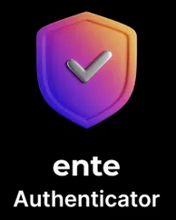

2 Factor Authentication
=====

Definiton: 2FA (2 Factor Authentication) is a security process in which users provide two different authentication factors to verify themselves.

Implementation: An *Authenticator App* will be the 2FA method. The 2FA mechanism is TOTP (Time-based-One-Time-Passwords), which are rotating, 6-digit codes presented in the *Authenticator App* for each of your online accounts. 

Resulting workflow: Typical, online account, login steps
   
   - Enter an account password from the :doc:`password manager` Tutorial
   - Enter a TOTP from the *Authenticator App*, from this Tutorial.
      
      - If this option is not availalable, an SMS will be recieved and used (set up in the :doc:`virtual phone numbers` Tutorial).
      
.. _2fa-software:

|logo_ente_auth_bg| Software
------------

**Ente Auth**

Why this software?  

* Provides critical features unavailable from other *Authenticator Apps*, including:

   - Open Source
   - Encrypted backups to the Ente Auth cloud (only you, not Ente, retains the encryption keys)
   - Quick recovery on another device

.. note::

   If you already use an *Authenticator App*, all entries will be migrated to *Ente Auth*.
   
.. _2fa-install:

|logo_ente_auth| Install
------------

Install on your smartphone.

.. note::

   External link: https://ente.io/auth/

.. _2fa-account:

|logo_ente_auth| Account
------------ 

1. On your smartphone, open the app *Ente Auth* and choose sign up.
2. On your smartphone, open the app *Bitwarden*
   
   - Create a new account entry for *Ente Auth*:
      
	  - Note - if you use Ente for photos, use a new and unique Ente account for Ente Auth.
      - Name: ``Ente Auth - example@gmail.com``
      - Username: ``example@gmail.com``
      - Password: (generate a password within *BitWarden*)
      - URL: ``https://auth.ente.io/login``
      - Save the entry in *Bitwarden*

3. On your smartphone in app *Bitwarden*, tap on the new *Ente Auth* account entry
   
   - Copy the username and paste into the app, *Ente Auth*
   - Repeat this process for the password
   - Save the account settings within the app, *Ente Auth*
4. Verify your email address.
5. On your computer, log into Ente ``https://web.ente.io``

   - Click on Settings (top-left) and click on Two-Factor
   - Enable 2FA
   - On your smartphone, in the app *Ente Auth* scan this QR code.
   - On your computer, verify this new 2FA entry.
   - Save the recovery code in the app *BitWarden*, within the account entry for Ente Auth (this is a critial step to maintain access to the account)

.. _2fa-usage:

|logo_ente_auth| Usage
------------

This section is under construction.

|logo_ente_auth| Migrate
------------

All entries in any other *Authenticator Apps* should be migrated to *Ente Auth*. This process will be the similar to the :ref:`2fa-usage` Tutorial section.

   - Navigate, in a browser, to the account security section of the online account, detailed in the :ref:`2fa-usage` section.
      
      - Within the online account, remove the current Authenticator App entry. Then follow :ref:`Ente Auth Documentation <2fa-Ente Auth-documentation>` to add a new 2FA entry in the *Ente Auth* app.
   - In the old Authenticator App, delete that entry.

  .. note::

   If you use Duo Push for work, leave that single entry in the Duo app.   

.. _2fa-essential-recovery:

Essential Recovery
------------

Steps for recovery, if/when any or all of your digital devices become inaccessible/lost/stolen or damaged beyond usage:

   - *BitWarden* :ref:`password-manager-essential-recovery`
   - 2FA :ref:`2fa-install`
      
      - Login

This tutorial is complete!
