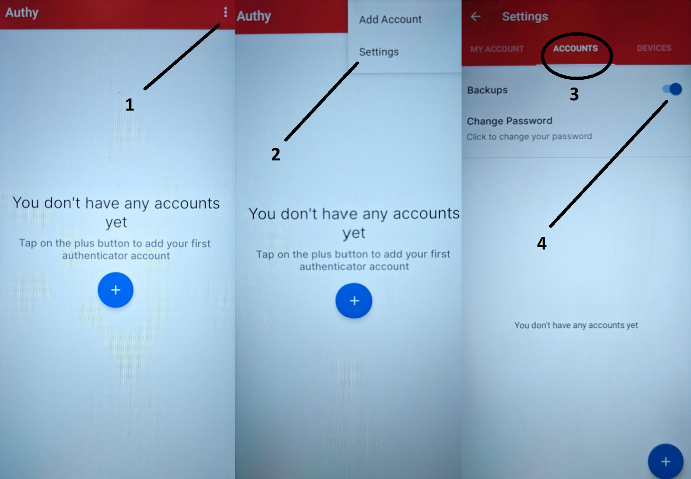
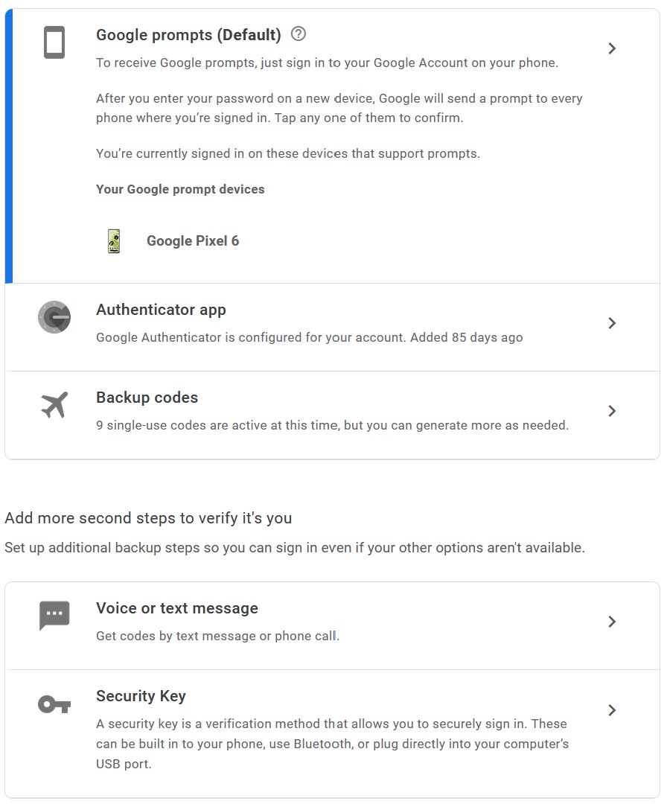

2 Factor Authentication
=====

Definiton: 2FA (2 Factor Authentication) is a security process in which users provide two different authentication factors to verify themselves.

Implementation: An *Authenticator App* will be the 2FA method. The 2FA mechanism is TOTP (Time-based-One-Time-Passwords), which are rotating, 6-digit codes presented in the *Authenticator App* for each of your online accounts. 

Resulting workflow: Typical, online account, login steps
   
   - Enter an account password from the :doc:`password manager` Tutorial
   - Enter a TOTP from the *Authenticator App*, from this Tutorial.
      
      - If this option is not availalable, an SMS will be recieved and used (set up in the :doc:`virtual phone numbers` Tutorial).
      
.. _2fa-software:

|logo_authy_bg| Software
------------

**Authy**

Why this software?  

* Provides critical features unavailable from other *Authenticator Apps*, including:

   - Encrypted backups to the Authy cloud
   - Quick recovery on another device

.. note::

   If you already use an *Authenticator App*, all entries will be migrated to *Authy*.
   
.. _2fa-install:

|logo_authy| Install
------------

Install on your smartphone.

.. note::

   External link: https://authy.com/download/

.. _2fa-account:

|logo_authy| Account
------------ 

1. On your smartphone, open the app and enter the :ref:`Primary Virtual Phone Number <virtual-phone-numbers-choose-primary-provider`>.
2. Add your email
3. Verify the account using any of the methods provided in the app
4. You should receive an email from *Authy* saying a new device was added to your Authy account - no action is needed
5. On the top-right of the app, tap the Kebob button (3 vertical, stacked dots) and tap Settings
6. On the top-center of the app, tap Accounts and enable Backups

7. On your computer (less efficient on a smartphone)
   
   - Log into *Bitwarden*, and record the following:
      
      - Name: ``Authy - example@gmail.com``
      - Username: ``example@gmail.com``
      - Password: (generate a password within *BitWarden*)
      - URL: ``https://authy.com/login/``

      - Notes: 
         
         - Linked phone number (*TextNow*): ``your_phone_number``
         - ``Authy@your_phone_number``
      - Save the entry in *Bitwarden*

8. On your smartphone, log into *Bitwarden* and tap on the new *Authy* account entry
   
   - Copy the password
9. Switch to the app, *Authy*, and paste the new password.
   
   - Save the change, close and re-open the app
   - Verify the Backups option is still enabled

.. _2fa-usage:

|logo_authy| Usage
------------

*Authy* Documentation is great and so that will be leveraged.

The :ref:`password-manager-core-email-account` will be the first account using 2FA. 

   - **Follow Authy Documentation to add a 2FA entry for the account**.

.. _2fa-authy-documentation:

.. note::
   *Authy* Documentation for a google account
      
      - External link: https://authy.com/guides/googleandgmail/
   *Authy* Documentation for other accounts
      
      - External Link: https://authy.com/guides/

**A few critical changes will be made after Authy Documentation steps are completed**
   - Generally, these are adding secure, alternative 2FA methods and removing insecure, alternative 2FA methods

.. note::

   While these are the steps specific to a Google/Gmail account, the same principles will be applied to all online accounts in a later Tutorial.

In the browser, where *Authy* Documentation guided you, navigate to where the Authenticator App was selected and complete the following:

   - Note if *Google Prompts* is used. Verify your current smartphone is the only device listed. Disregard if not used.
   - Verify that the Authenticator App is used - this is what was configured from the *Authy* Documentation.
   - Enable *Backup Codes*. Store these in *Bitwarden*, under this email account entry, at the bottom of the Notes section.
      
      - If you ever need to log in with a *Backup Code*, be sure to mark the code as expired here. Set a rule, in your brain, to replace all *Backup Codes* after having used no more than 2 or 3 of them. The picture below shows 1 *Backup Code* has been used, since Google provides 10 codes.
   - **Critical - Verify no phone number is used. If one is configured, remove it.**
   - Security Questions and Answers
      
      - Each answer should be changed to something nonsensical.
         
         - ``Security Q1: ___, Security A1: ___something blah random___; Security Q2: ___, Security A2: ___something other blah random___``
            - Note: Financial and other Institutions may require real info, like Date of Birth, but security questions must not include real info. For example, do not answer with your real Mother's Maiden Name.
   - At this time, *Security Keys* are not recommended.
   - Notate, in *Bitwarden*, under this email account entry's Notes section, that Authy is used. Enter  ``Authy@your_phone_number``.

.. _2fa-migrate:

|logo_authy| Migrate
------------

All entries in any other *Authenticator Apps* should be migrated to *Authy*. This process will be the similar to the :ref:`2fa-usage` Tutorial section.

   - Navigate, in a browser, to the account security section of the online account, detailed in the :ref:`2fa-usage` section.
      
      - Within the online account, remove the current Authenticator App entry. Then follow :ref:`Authy Documentation <2fa-authy-documentation>` to add a new 2FA entry in the *Authy* app.
   - In the old Authenticator App, delete that entry.

  .. note::

   If you use Duo Push for work, leave that single entry in the Duo app.   

.. _2fa-essential-recovery:

Essential Recovery
------------

Steps for recovery, if/when any or all of your digital devices become inaccessible/lost/stolen or damaged beyond usage:

   - *BitWarden* :ref:`password-manager-essential-recovery`
   - *Virtual Phone Numbers*' :ref:`virtual-phone-numbers-essential-recovery`
   - 2FA :ref:`2fa-install`
      
      - Login

This tutorial is complete!
