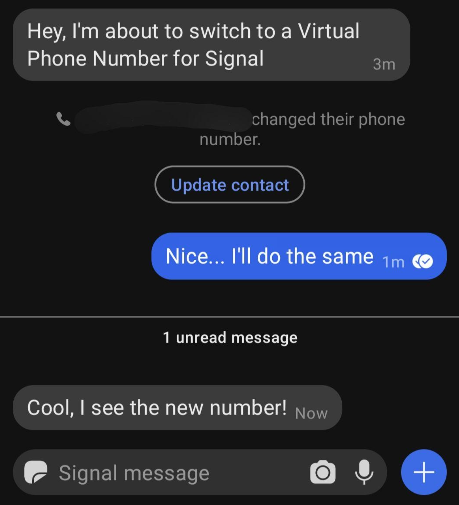

Communication Continued
=====

|logo_signal_bg| *Signal* registration will be changed from the Carrier Number to the :ref:`Primary Virtual Phone Number <virtual-phone-numbers-choose-primary-provider>`.

Before changing the registration number, you might wish to let a most-trusted contact know before doing so.

.. _communication-continued-change-signal-registation:

Change Signal Registation
------------

Open *Signal* on your smartphone and navigate to Settings > Account > Change Phone Number.

   - Follow the prompts
   
   - The other side of your current chats will see this change.

.. _communication-continued-other-communication-apps:

Other Communication Apps
------------

Consider changing other communication apps to using this *Primary Virtual Phone Number*, like WhatsApp - Note: not compatible with *TextNow*.

.. note::
   The ability to quickly and securely switch to another smartphone or SIM/cell provider, without losing access to your people and stuff, is incredibly powerful.

This Tutorial is complete!
