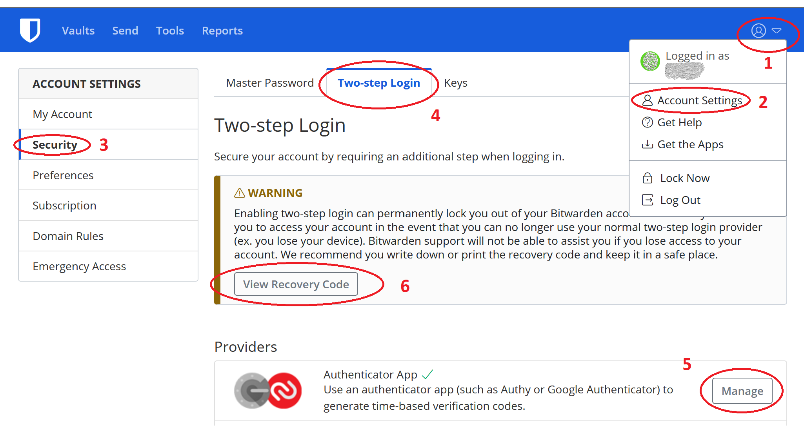

|logo_bitwarden_bg| Password Manager Continued
=====

.. |logo_bitwarden_bg| image:: images/password_manager/logo_bitwarden.png
   :width: 15%

2FA will be enabled for your Bitwarden account, now that all of the necessary tools are in place.

.. _password-manager-continued-preparation:

|logo_bitwarden| Preparation
------------

.. |logo_bitwarden| image:: images/password_manager/logo_bitwarden.png
   :width: 8%

*Bitwarden* will only require the *Bitwarden 2FA Code*, when signing into a browser or when signing into the app for the first time (new smartphone, computer, etc). This 2FA will be retrieved from *Enty Auth*. Should any device with your *Bitwarden* or *Enty Auth* become inaccessible, the *Bitwarden Recovery Code* will be used - it is 39 characters long. This is considered a disaster recovery scenario and steps will be taken to plan for that possiblity.

.. warning::

   This is an opportunity to decide what information should be available in medical or disaster recovery scenarios. An approach is below, but whatever approach is chosen, the *Bitwarden Recovery Code* should be stored in 4 places.
 
.. note::
   Consider sharing, via :doc:`Secure Communication <communication>`, the *Bitwarden Recovery Code* with two people - one of which is not travelling and/or living with you (this makes recovery scenarios more robust). These people will, ideally, also follow the **Vonvoo Method**. How will you get the code from them? Inform these persons to never respond to requests for the code by extortion.
   These considerations can be scary at first, but they are little different then estate or insurance planning.

.. warning::

   If these Tutorials are completed in a group chat, do not share sensitive information.
   
      - For example, do not advertise to whom you may be sharing your *Bitwarden Recovery Code*.
      - It is also best not to request, in the group chat, a volunteer to store a copy for you. This should be communicated in a 1:1 chat, with a most trusted person.

Within *Bitwarden*, create an entry as a self-reference (This does not count as 1 of the 4 storage places.)
   
   - Create a new folder, within *Bitwarden*, named ``Bitwarden``.
   - In this folder, create an entry named ``Bitwarden - example@gmail.com``
   - Password will be the *Bitwarden Master Password*
   - Notes section
      
      - *Bitwarden Recovery Code*: ``placeholder for the code``
      - How many emergency cards will be created, where these cards will be located, and to whom the code will be shared.
   - Save the entry.
      
.. note::
   Others, who might share their *Bitwarden Recovery Code* with you, would have a separate entry in this folder.

.. _password-manager-continued-verify-the-bitwarden-account:

|logo_bitwarden| Verify the *Bitwarden* Account
------------

On your computer...
   
   - In the browser, navigate to the *Bitwarden Web Vault*

  .. Warning::
     Never allow the browser to save the *Bitwarden* credentials.

...Log in
   
   - Choose Verify your account
   - Follow those instructions

.. note::
   External Link: https://vault.bitwarden.com

.. _password-manager-continued-export-the-bitwarden-vault:

|logo_bitwarden| Export the *Bitwarden Vault*
------------

On your computer...
   
   - In the browser, navigate to the *Bitwarden Web Vault*

  .. Warning::
     Never allow the browser to save the *Bitwarden* credentials.

...Log in
   
   1. Choose **Tools** (top)
   2. Choose **Export Vault** (far-left)
   3. Choose the File Format drop-down option **.json (Encrypted)**
   4. Choose **Export Vault**
   
      - Save this file to an unencrypted location.

.. note::
   External Link: https://vault.bitwarden.com

.. note::
   Make an encrypted export after:
      
      - Making broad changes to the Vault
      - After changing the *Bitwarden Master Password*

         - The *Bitwarden Master Password* only needs to be changed if you suspect a breach to the Vault itself.

.. _password-manager-continued-enable-2fa-for-bitwarden:

|logo_bitwarden| Enable 2FA for Bitwarden
------------

On your computer...
   
   - In the browser, navigate to the *Bitwarden Web Vault*

  .. Warning::
     Never allow the browser to save the *Bitwarden* credentials.

...Log in
   
   - Choose Verify your account
   - Follow those instructions
   
   1. Choose **Profile** (top-right)
   2. Choose **Account Settings**
   3. Choose **Security** (far-left)
   4. Choose **Two-step Login** (top-middle)
   5. Choose Providers > Authenticator App > **Manage**
      
      - On your smartphone, open the *Enty Auth* app. Tap the plus button (bottom-right) and choose Add Account. Scan a QR code and save the entry.
         
         - Enter the TOTP (verification code), in the browser.
         
            - Choose **Enable**.
               
               - Choose **Close**.
   6. In the browser, choose View Recovery Code (this is the *Bitwarden Recovery Code*)
         
         6.1 **Write** this code on a small piece of paper 
               
               - OR
         6.1 **Copy/paste** into Notepad and print it. Delete the contents of Notepad and close the Notepad app (Do not save the file).
         
         6.2 **Copy/paste** the code into the Bitwarden entry created earlier: ``Bitwarden - example@gmail.com``
            
            - Save the entry in *Bitwarden*

**Verify that you have completed BOTH subsections 6.1 and 6.2**

.. _password-manager-continued-bitwarden-recovery-code-storage:

|logo_bitwarden| Bitwarden Recovery Code Storage
------------

Suggested *Bitwarden Recovery Code* Storage methods

   - Two laminated, Emergency Cards (in the wallet and another that is hidden, separately), listing

      - Name
      - DOB
      - Passport/Identifaction number
      - Medical Allergies
      - Emergency contact
      - Insurance and contact/claim info
      - *Bitwarden Recovery Code*
         
         - Place on the back of the card, in case a medical professional takes a photo of the card.
         - Do not indicate that this code is for *Bitwarden*. Just provide the code.

   - Share the *Bitwarden Recovery Code* to two trusted people.
      
      - Via the Signal :doc:`communication` Tutorial.
      
         - Copy/Paste this into your first Signal message: ``Please save my Bitwarden Recovery Code in your Password Manager. I'm following the Vonvoo Guide https://vonvoo.com``
         - From the Bitwarden account entry, copy/paste the *Bitwarden Recovery Code* as your second Signal message.
         
            - A separate (the second) message for the code is considerate, so that copy/paste is convenient for the trusted person.
         - If they ask ``What's that?``, you can say ``That is the Disaster Recovery Code for my Password Manager``
         
            - One would need the *Bitwarden Master Password* and *Recovery Code* to log in.

.. note::
   While you are at it, consider laminating two **copies** of your passport and vaccination card (follow applicable laws).

.. _password-manager-continued-essential-recovery:

Essential Recovery
------------

Steps for recovery, if/when any or all of your digital devices become inaccessible/lost/stolen or damaged beyond usage:

   - *BitWarden* :ref:`password-manager-install`
   - *Bitwarden* :ref:`Recovery Code Storage <password-manager-continued-bitwarden-recovery-code-storage>`
   - *2FA* :ref:`Install <2fa-install>`
   - *Bitwarden* :ref:`Re-enable 2FA for Bitwarden <password-manager-continued-enable-2fa-for-bitwarden>`

This tutorial is complete!
