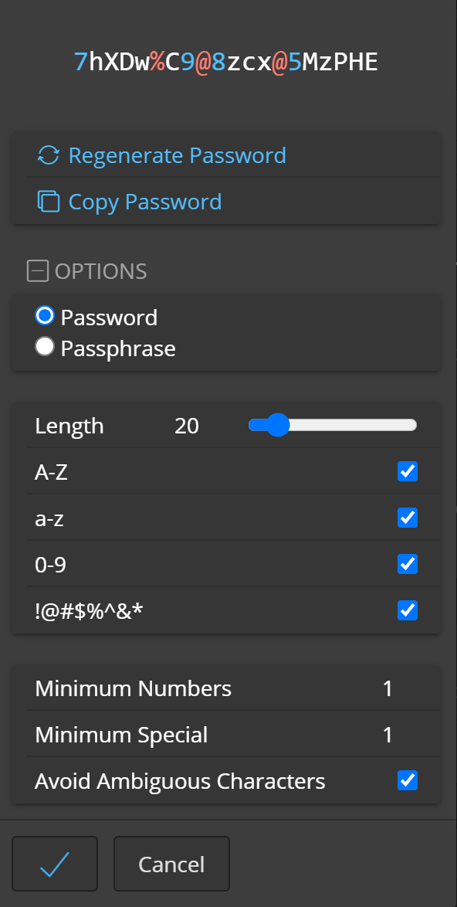
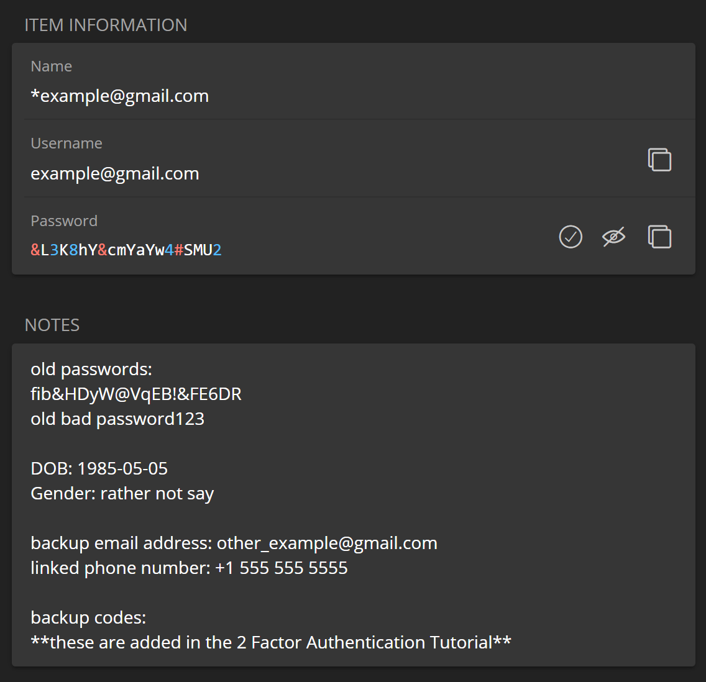

Password Manager
=====

Definiton: A *Password Manager* is an app that allows users to store, generate, and manage their passwords for local applications and online services.

Resulting workflow: The *Password Manager* will become the most critical component in the toolset. Expect to use it frequently.

.. _password-manager-software:

|logo_bitwarden_bg| Software
------------

**Bitwarden**

Why this software?  

* Open-Source
* Cross-Platform

.. note::

   If you already use a secure, open source *Password Manager*, verify the application settings are hardened, like in the :ref:`password-manager-configure` section, and then verify you are following the general best-practice principles in the :ref:`password-manager-usage` section. It is then crital to consider your disaster recovery scenarios.
   
      For example, if you use Keepass, synced via Dropbox, consider Dropbox behavior when logging in from a new device. They will likely require email verification. If the *Password Manager* is relied upon for email access, this creates a lock-out scenario. See :ref:`Bitwarden's implementation <password-manager-continued-preparation>`, for more info.
   
.. _password-manager-install:

|logo_bitwarden| Install
------------

* Install on your computer to set things up - this is most efficient, though the smartphone app can be used as an alternative.
* Install on your smartphone.

.. note::

   External link: https://bitwarden.com/download/

.. _password-manager-account:

|logo_bitwarden| Account
------------ 

1. Create an account with Bitwarden using your core email address

   - Your core email address is the most important one.

2. A *Bitwarden Master Password* is needed.

   - Create this new password in your brain - the password must be something new to you. It should be at least 14 characters, including alpha, numeric and special characters.

   - Tear off a small piece of paper.

   - **Write this new password on the small piece of paper**. Do not write a label or identifier on this paper.

   - **Hide this piece of paper**. Practice logging into Bitwarden, at least every day, until you are certain that you will never need this piece of paper ever again.
   
   - Set a goal of this certainty to be acheived within no more than 2 weeks.

   - If you wish to share this *Bitwarden Master Password* (or other passwords) with a most-trusted person, it is recommended to upgrade to a Bitwarden Family Plan. You can proceed here, and then upgrade at a later time.

   - **Then burn this piece of paper**.

      - At this time and for most people, it is not recommended to use biometric login, like a phone's fingerprint scanner. Refer to the :ref:`password-manager-behavior` section for more info.

   - Now you have one - new and secure - password to remember. You will use this to access any others at the completion of these tutorials.

.. _password-manager-configure:

|logo_bitwarden| Configure
------------

On your computer, log into the *Bitwarden* app and configure these settings:

   - File \> Settings \> Security
      
      - Vault Timeout: **5 minutes**
      - Vault Timeout Action: **Lock**

   - File \> Settings \> Preferences
      
      - Clear Clipboard: **30 seconds**

On your smartphone, log into the *Bitwarden* app and configure these settings:

   - Settings \> Security
   
      - Vault Timeout: **5 minutes**
      - Vault Timeout Action: **Lock**
   
   - Settings \> Other \> Options
   
      - Clear Clipboard: **30 seconds**

.. _password-manager-usage:

|logo_bitwarden| Usage
------------

.. note::

   Practice and configure! The first entry should be a test entry. This step will also configure the password generator settings.
   
1. Log into *Bitwarden* with your *Bitwarden Master Password* and create the new test entry.
2. Use the password generator button, which is next to the password field. In the pop-out window, use the ``+Options`` button. Set the following:

   - Length: **20**
   - Special characters: **Enable**
   - Save settings

3. Copy this new password, from the Password field, into the top of the Notes field.
4. Now generate a new password, with the password generator button.
5. Save the entry, close the app, re-open the app, and log back in. 
6. Verify all test data entered is in this test entry, including the new password (in the password field) and the old password (in the notes section).

.. _password-manager-core-email-account:

|logo_bitwarden| Core Email Account
------------

The second entry should be for your core email account. Record the following:

1. Name: account entry name. 

   - An example would be ``*example@gmail.com``

      - Prepending the email address with an ``*`` lets you quickly search, within *Bitwarden*, the actual entry for your email account. 
      
         - This will be useful, since most account entries will reference your email account as well.
         
            - Not all account entry names in *Bitwarden* should be prepended with an ``*``.
            - This naming convention is just a method for efficiency

2. Username: email address
3. Current password
4. Notes

   - Date of birth used
   - Any password hints or required info from the email provider

5. Save the entry
6. Now log into your email account, being sure to login in by pasting the email address and password from Bitwarden into the web-login
7. In Bitwarden, copy the current email account's password and paste it into the top of the notes field
8. Use the password generator button to create a new, secure password
9. Save the entry in *Bitwarden*.
10. In the browser, navigate to the account provider's \"change password\" form.
11. Change the password using copy/paste via *Bitwarden*.

   - If the account provider returns an error about the new password, this generally means that they have bad security policies for passwords.
   
      - A new email provider should be used, though you will still benefit from changing this password anyway. Modify the password in *Bitwarden* to satisfy their requirements and paste this new password into the password field for the online account.
      - Once successful, save the entry in *Bitwarden*
10. Log out of the online service and log back in, using copy/paste via *Bitwarden*, to verify that the password change was successful.

Example for an email account

.. _password_manager_example_gmail_com:

Example for another account

.. _password_manager_example_github:

.. warning::

   If you already suspect a breach of any accounts, you should secure them with the above method, in Bitwarden, before continuing the tutorials.

\

.. note::

   Goals: Additional tools will be implemented and integrated into these accounts. For this reason, it is more efficient to secure all other online accounts later in the tutorials, after those tools have been implemented.

Here are some rules for setting passwords and reasons why a *Password Manager* is necessary:

1. Passwords should never be re-used - they should be unique for every account.
2. Passwords should be randomly generated and at least 14-18 characters in length.
3. Since it is impossible to remember all of these (except the *Bitwarden Master Password*), this is why a *Password Manager* is required.
4. The browser extension for Bitwarden, or for any *Password Manager*, is not recommended - it a most vulnerable vector for breaches. Simply rely on the application.
5. The Desktop Application Shortcuts can be used to navigate quickly through Bitwarden. It will become comfortable and confident, relying on muscle memory. These shortcuts are documented by *Bitwarden*.

.. note::

   External link: https://bitwarden.com/help/keyboard-shortcuts/#desktop-application-shortcuts

6. An occasional password change or account entry addition is easy to do in the smartphone app, though broad changes will be easer on a computer.

.. _password-manager-behavior:

|logo_bitwarden| Behavior
------------

When typing your *Bitwarden Master Password*, be concious of shoulder-surfers or cameras recording your keyboard. 

   - For example, when on a smartphone in public, this concern can be mitigated by rotating the screen and/or your body slightly while entering the Bitwarden Master Password. 

      - **We are simply changing our behaviour to minimize risk**.
      
.. _password-manager-essential-recovery:

Essential Recovery
------------

Steps for recovery, if/when any or all of your digital devices become inaccessible/lost/stolen or damaged beyond usage:

   - *BitWarden* :ref:`password-manager-install`
      
      - Log in
      - *Bitwarden* 2FA :ref:`password-manager-continued-preparation`

This tutorial is complete!
